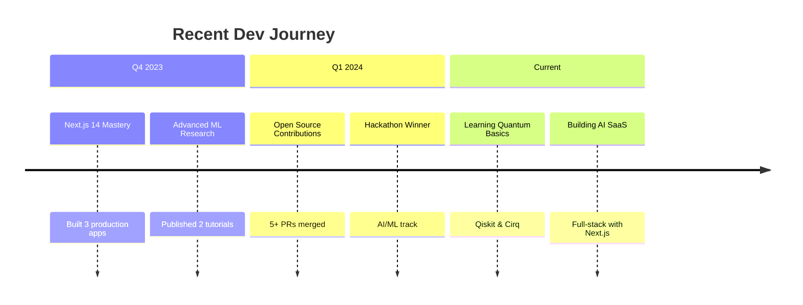

<p align="center">
  
</p>

<p align="center">
  <a href="https://git.io/typing-svg">
    
  </a>
</p>

<p align="center">
  <a href="https://github.com/yasiruchamathka?tab=repositories">
    
  </a>
  
  <a href="https://github.com/yasiruchamathka?tab=followers">
    
  </a>
  <a href="https://github.com/yasiruchamathka?tab=stars">
    
  </a>
</p>

<p align="center">
  <a href="https://linkedin.com/in/your-profile">
    
  </a>
  <a href="https://twitter.com/yourhandle">
    
  </a>
  <a href="https://portfolio.yasiru.dev">
    
  </a>
  <a href="mailto:hello@yasiru.dev">
    
  </a>
</p>

---

<div align="center">
  
## 🧠 About Me

**Building intelligent systems at the intersection of AI and high-performance applications**

</div>

<div align="center" width="80%">
  
> *"First, solve the problem. Then, write the code."* – **John Johnson**

</div>

### 💫 My Philosophy
I'm a passionate **self-taught developer** who believes in creating elegant, scalable solutions that push technological boundaries. My approach combines **mathematical rigor** with **practical implementation**.

| Principle | Implementation |
|-----------|----------------|
| **Clean Code** | TypeScript strict mode, comprehensive tests, and consistent patterns |
| **Scalable Architecture** | Microservices, containerization, and cloud-native designs |
| **Continuous Learning** | Daily coding, research paper reading, and open-source contributions |

### 🎯 Current Focus
- 🔭 **Building**: Next.js 14 applications with AI integrations
- 🌱 **Learning**: Advanced ML architectures (Transformers, GANs)
- 🤝 **Collaborating**: Open-source AI projects and hackathons
- 💡 **Exploring**: Quantum computing basics and C++ optimization

---

## 🛠️ Tech Stack

<div align="center">
  
</div>

<details>
<summary><b>📊 Click to see detailed tech breakdown</b></summary>
<br>

**Frontend Mastery**
```javascript
const frontendStack = {
  frameworks: ["Next.js 14", "React 18", "Astro"],
  languages: ["TypeScript", "JavaScript"],
  styling: ["Tailwind CSS", "ShadCN/ui", "Framer Motion"],
  stateManagement: ["Zustand", "TanStack Query", "Redux Toolkit"]
};
```

**AI/ML Toolkit**
```python
class AIMLStack:
    frameworks = ["TensorFlow", "PyTorch", "HuggingFace", "OpenAI"]
    libraries = ["scikit-learn", "NumPy", "Pandas", "SciPy"]
    deployment = ["TensorFlow Serving", "ONNX", "Docker", "FastAPI"]
```

**Backend & Systems**
```cpp
namespace Backend {
    vector<string> languages = {"Python", "C++", "Node.js"};
    vector<string> databases = {"PostgreSQL", "MongoDB", "Redis"};
    vector<string> devops = {"Docker", "GitHub Actions", "AWS", "Nginx"};
}
```

</details>

---

## 📈 GitHub Analytics

<div align="center">
  
### **Activity & Contributions**
  
<picture>
  <source media="(prefers-color-scheme: dark)" srcset="https://github-readme-activity-graph.vercel.app/graph?username=yasiruchamathka&theme=react-dark&bg_color=0d1117&hide_border=true&area=true&line=7E3ACE&point=9d4edd&color=7E3ACE">
  
</picture>

### **Performance Metrics**

<table>
  <tr>
    <td align="center" width="50%">
      
    </td>
    <td align="center" width="50%">
      
    </td>
  </tr>
  <tr>
    <td align="center" width="50%">
      
    </td>
    <td align="center" width="50%">
      
    </td>
  </tr>
</table>

</div>

---

## 🚀 Featured Projects

<div align="center">

### **AI & Full-Stack Applications**

</div>

<table>
  <tr>
    <td width="33%">
      <h3 align="center">🤖 <b>Project Nova</b></h3>
      <p align="center">
        <em>AI-Powered Analytics Dashboard</em>
      </p>
      <p align="center">
        
        
        
      </p>
      <p align="center">
        Real-time ML predictions visualization with interactive dashboards
      </p>
      <p align="center">
        <a href="https://github.com/yasiruchamathka/project-nova">
          
        </a>
      </p>
    </td>
    <td width="33%">
      <h3 align="center">⚡ <b>Quantum CLI</b></h3>
      <p align="center">
        <em>Developer Toolchain Automation</em>
      </p>
      <p align="center">
        
        
        
      </p>
      <p align="center">
        High-performance CLI for automating development workflows
      </p>
      <p align="center">
        <a href="https://github.com/yasiruchamathka/quantum-cli">
          
        </a>
        <a href="#">
          
        </a>
      </p>
    </td>
    <td width="33%">
      <h3 align="center">🛡️ <b>Sentinel AI</b></h3>
      <p align="center">
        <em>Real-time Threat Detection</em>
      </p>
      <p align="center">
        
        
        
      </p>
      <p align="center">
        Neural network for anomaly detection in time-series data
      </p>
      <p align="center">
        <a href="https://github.com/yasiruchamathka/sentinel-ai">
          
        </a>
      </p>
    </td>
  </tr>
</table>

<div align="center">
  
<details>
<summary><b>📁 View More Projects</b></summary>
<br>

| Project | Description | Tech | Status |
|---------|-------------|------|--------|
| **Neural Chat** | AI chatbot with custom-trained models | Python, Transformers, FastAPI | 🔄 Active |
| **Code Optimizer** | Automated code performance analysis | C++, LLVM, Python | ✅ Complete |
| **ML Ops Pipeline** | End-to-end ML deployment system | Docker, Kubernetes, TFX | 🚀 In Production |

</details>

</div>

---

## 📅 Recent Highlights



---

<div align="center">

## 🌟 Let's Connect!

<p align="center">
  <a href="https://linkedin.com/in/your-profile">
    
  </a>
  <a href="mailto:hello@yasiru.dev">
    
  </a>
  <a href="https://github.com/yasiruchamathka">
    
  </a>
</p>

<p align="center">
  
</p>

<p align="center">
  
</p>

<p align="center">
  
</p>

<p align="center">
  <i>"The best way to predict the future is to create it."</i> – <b>Alan Kay</b>
</p>

<p align="center">
  <sub>✨ Built with ❤️ and lots of ☕</sub>
</p>

</div>
