# 🚀 **ULTIMATE COOL VERSION** 🚀

<p align="center">
  
</p>

<div align="center">
  
</div>

<div align="center">
  
</div>

<div align="center">
  <a href="https://github.com/yasiruchamathka?tab=repositories">
    
  </a>
  
  <a href="https://github.com/yasiruchamathka?tab=followers">
    
  </a>
</div>

<br>

<div align="center">
  <a href="https://linkedin.com/in/your-profile">
    
  </a>
  <a href="https://twitter.com/yourhandle">
    
  </a>
  <a href="https://github.com/yasiruchamathka">
    
  </a>
  <a href="mailto:hello@yasiru.dev">
    
  </a>
</div>

<br>

<div align="center">
  
  
</div>

<br>

<div align="center">
  
  
</div>

<br>

<div align="center">
  
</div>

<br>

## 🎯 **MY MISSION**

> ***"Turning complex AI problems into elegant, scalable solutions"***

<div align="center">
  
| **What I Build** | **Tech I Use** | **Results** |
|------------------|----------------|-------------|
| 🔥 AI-Powered Web Apps | Next.js + FastAPI + PyTorch | 10x Performance Boost |
| 🤖 Machine Learning Models | TensorFlow + Scikit-learn | 95%+ Accuracy |
| ⚡ High-Performance Systems | C++ + Python + Docker | Sub-10ms Latency |
| 🚀 Full-Stack Solutions | TypeScript + Python + PostgreSQL | Enterprise Scale |

</div>

<br>

## 💻 **DAILY DRIVERS**

```javascript
const dailyStack = {
  morning: ["☕ Coffee", "📚 Research Papers", "💻 Code Review"],
  afternoon: ["🚀 Building AI Models", "⚡ Optimizing Systems", "🎨 UI/UX Design"],
  evening: ["📖 Learning New Tech", "🔧 Open Source", "🎮 Gaming"]
};
```

<br>

## 🏆 **TOP PROJECTS**

<div align="center">

<table>
  <tr>
    <td align="center" width="100%">
      <h3>🔥 <b>AI DASHBOARD</b></h3>
      <p><em>Real-time Analytics Platform</em></p>
      <div>
        
        
        
      </div>
      <p>🚀 Live ML predictions • 📊 Interactive charts • ⚡ Real-time updates</p>
      <a href="https://github.com/yasiruchamathka/project-nova">
        
      </a>
    </td>
  </tr>
</table>

<table>
  <tr>
    <td width="50%">
      <h3 align="center">⚡ <b>QUANTUM CLI</b></h3>
      <p align="center"><em>Developer Toolchain</em></p>
      <p align="center">
        
        
      </p>
      <p align="center">🚀 High-performance CLI tool</p>
      <p align="center">
        <a href="https://github.com/yasiruchamathka/quantum-cli">
          
        </a>
      </p>
    </td>
    <td width="50%">
      <h3 align="center">🛡️ <b>SENTINEL AI</b></h3>
      <p align="center"><em>Threat Detection</em></p>
      <p align="center">
        
        
      </p>
      <p align="center">🤖 Neural network for security</p>
      <p align="center">
        <a href="https://github.com/yasiruchamathka/sentinel-ai">
          
        </a>
      </p>
    </td>
  </tr>
</table>

</div>

<br>

## 📊 **CODING ACTIVITY**

```mermaid
gantt
    title Weekly Development Schedule
    dateFormat  HH:mm
    axisFormat %H:%M
    
    section AI/ML Development
    Model Training      :08:00, 4h
    Data Processing     :12:00, 2h
    Model Optimization  :14:00, 2h
    
    section Web Development
    Frontend Work       :09:00, 3h
    Backend API         :13:00, 3h
    Testing & Debug     :16:00, 2h
    
    section Learning
    Research Papers     :18:00, 2h
    New Technologies    :20:00, 2h
```



<br>

## 🎮 **COOL STATS**

<div align="center">
  
| **Metric** | **Value** | **Badge** |
|------------|-----------|-----------|
| **Code Written** | 500K+ lines |  |
| **Projects Built** | 50+ |  |
| **AI Models** | 20+ |  |
| **Git Commits** | 1000+ |  |

</div>

<br>

## 🔥 **TECH POWER METER**

<div align="center">
  
**Next.js/React** ⭐⭐⭐⭐⭐  
**Python/AI-ML** ⭐⭐⭐⭐⭐  
**TypeScript** ⭐⭐⭐⭐☆  
**C++** ⭐⭐⭐⭐☆  
**FastAPI** ⭐⭐⭐☆☆  
**Docker** ⭐⭐⭐☆☆  

</div>

<br>

## 🎵 **CURRENT VIBE**

<div align="center">
  
[](https://open.spotify.com/user/your-spotify-id)

</div>

<br>

## 🚀 **LET'S BUILD TOGETHER**

<div align="center">
  
### **🔥 COLLABORATE • 🤝 CONNECT • 🚀 INNOVATE**

<a href="https://github.com/yasiruchamathka">
  
</a>
<a href="mailto:hello@yasiru.dev">
  
</a>
<a href="https://linkedin.com/in/your-profile">
  
</a>

</div>

<br>

<div align="center">
  


<br>


<br>


<br>

**✨ CODING THE FUTURE, ONE LINE AT A TIME ✨**

</div>

---

<div align="center">
  
*"The best way to predict the future is to invent it."* - **Alan Kay**

⭐ **Star my repos if you like what I build!** ⭐

</div>
